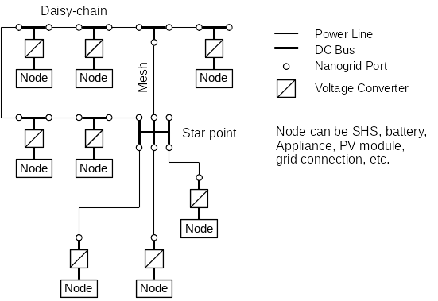

# Grid Topology

The DC grid allows to interconnect multiple energy sources and sinks.

Compared to conventional grids, where the energy flow is mostly uni-directional from the energy source to the consumer, the meshed DC grid can operate in both directions. A battery for example can be a current source or a current sink.

In order to explain the grid topology, the overall system is divided into abstract sub-components, as described below. These components don't necessarily need to be separate physical devices, but can be different sub-components in one circuit.

### Power line

Bipolar connection (cable) between exactly two grid ports. Splices are not allowed.

A power line might cover long distances, resulting in a voltage drop caused by the resistance of the cable. The voltage drop has to be considered to allow stable system control.

### DC bus

Connection of two or more electrical circuits such that the electric potential at each connection point can be considered equal. This can be achieved either by connecting each participant very close to each other or by using large copper cross-section such that voltage drop introduced by current flow is negligible.

The cross section of the conductor must be large enough to handle the sum of the maximum current of all connected sources.

### DC grid port

Connection between a DC bus and a power line, featuring

- a circuit breaker or electronic switch to allow disconnection of the port for safety reasons or to optimize energy flows and
- measurement of port current and bus voltage.

### Voltage converter

A DC/DC converter, necessary to connect DC buses of different voltage levels, e.g. a battery or solar panel to the DC grid.

## System overview

The following image gives an example of a possible DC grid layout.

It consists of a daisy-chained bus topology at the left side, a star point in the middle and includes a loop. The overall topology is called a mesh, as it allows redundant current paths.

Above schematic diagram assumes two different types of node connections to the grid. One type includes two DC grid ports, i.e. allows daisy-chaining of nodes. The other nodes at the bottom have only one DC grid port and need to be connected to a current router (star-point).
